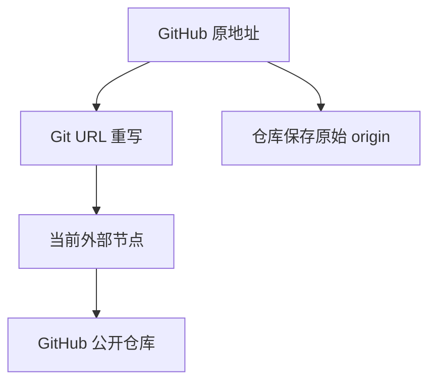

# GitBoost 最终 MVP 产品方案

版本：V1.0（最终收敛版）
日期：2026-08-11

## 1. 最终结论

GitBoost MVP 可行。它的准确定位是：

> 一个面向 GitHub 公开 HTTPS 仓库的跨平台桌面加速工具。用户继续使用原始 `https://github.com/...` 地址，应用把 Git 的读取地址临时重写到用户导入并选中的外部加速节点。

MVP 只做本地客户端，不建设服务器端系统：

- 不建设官方节点中心、爬虫、社区提交或管理后台。
- 不使用 SQLite 或其他数据库。
- 不运行本地 HTTP 转发服务，不代理 Git 数据流。
- 外部节点由用户批量粘贴或从本地 JSON 文件导入。
- 应用负责节点校验、测速、选择以及 Git 配置的安全写入与恢复。
- 开发按可验收交付批次执行，不采用传统团队的周数排期。

这一版本验证的是最核心假设：

> 用户是否愿意安装一个桌面工具，通过导入现有 GitHub 加速地址，在不改变日常 clone 命令的前提下获得更稳定的公开仓库下载体验。

## 2. 已验证的底层机制

应用向 Git 注册一份独立配置文件，并在其中使用 Git 原生 URL 重写：

```ini
[url "https://node.example/https://github.com/"]
    insteadOf = https://github.com/

[url "https://github.com/"]
    pushInsteadOf = https://github.com/
```

在 Git 2.51.1 的隔离配置实验中，结果为：

| 检查项 | 实际结果 |
|---|---|
| 仓库中保存的 `remote.origin.url` | `https://github.com/owner/repository.git` |
| fetch 生效地址 | `https://node.example/https://github.com/owner/repository.git` |
| 标准 remote 的 push 生效地址 | `https://github.com/owner/repository.git` |
| 精确仓库级加速规则 | 只重写清单中匹配的仓库 |

机制参考：[Git `url.<base>.insteadOf` / `pushInsteadOf` 文档](https://git-scm.com/docs/git-config#Documentation/git-config.txt-urlbaseinsteadOf)、[Git clone 文档](https://git-scm.com/docs/git-clone)、[Git Smart HTTP 协议](https://git-scm.com/docs/http-protocol)。

因此用户仍执行：

```bash
git clone https://github.com/owner/repository.git
git pull
git fetch
git push
```

仓库保存的 origin 不会被替换成节点地址。应用关闭加速后，已有仓库不需要逐个修复 remote。

但这套机制有三个不可回避的边界：

1. 应用不在 Git 数据链路中，无法感知某一次 clone 是否刚刚失败。
2. 已开始的传输无法在中途无感切换到另一个节点；换节点后需要重试命令。
3. 全局 `insteadOf` 无法自动判断仓库是公开还是私有，必须用路由模式和清单控制。

## 3. MVP 范围

### 3.1 必须实现

- Windows、macOS、Linux 桌面应用。
- 检测系统 Git 是否可用。
- 批量粘贴外部节点。
- 导入本地节点 JSON 文件。
- 节点增删、启用、禁用和重新命名。
- 使用真实 `git ls-remote` 校验 Git Smart HTTP 能力。
- 对可用节点进行多次测试，按成功率和耗时排序。
- 自动选择、固定节点、GitHub 直连三种线路状态。
- 全局加速、仅加速清单两种路由范围。
- 用独立 gitconfig 开启、切换和关闭加速。
- 公开仓库加速清单管理。
- Git 配置冲突、显式 `pushurl` 和带凭据 URL 的诊断。
- 配置备份、幂等恢复、诊断信息导出。
- 单元测试、集成测试和三平台端到端测试。

### 3.2 明确不实现

- 官方节点目录、远程订阅、自动抓取公开节点网站。
- 节点清单签名、CDN、服务端健康检查。
- SQLite、ORM、数据库迁移。
- 本地 HTTP/SOCKS 代理或常驻转发端口。
- 私有仓库加速。
- push 加速。
- SSH 地址处理。
- Git LFS、Release、Raw、Archive、GitHub 网页加速。
- 账号、登录、跨设备同步、社区和遥测后台。
- clone 中断续传和单次命令内的无感故障切换。
- 公开 CLI 产品；自动化测试可直接调用 Rust 核心。

## 4. 目标用户与使用前提

### 4.1 目标用户

- GitHub 公开仓库 clone、fetch、pull 较慢或不稳定的开发者。
- 使用终端、VS Code 或 JetBrains，并调用系统 Git 的用户。
- 已经有一批外部 GitHub 加速节点，但不想每次手动拼接代理前缀的用户。

### 4.2 使用前提

- 节点必须支持 Git Smart HTTP，能打开网页不代表能 clone。
- MVP 只接受可以表达为“固定前缀替换”的节点。
- 用户需要信任自己导入的第三方节点；节点能够看到被访问的公开仓库路径和传输内容。
- 使用私有仓库或不确定仓库性质的用户，应使用“仅加速清单”模式。

## 5. 核心用户流程

### 5.1 首次启动

1. 应用执行 `git --version`。
2. 检查用户现有 `include.path`、`insteadOf` 和 `pushInsteadOf` 冲突。
3. 用户批量粘贴节点或导入 JSON。
4. 应用在隔离配置中对每个节点执行真实 `git ls-remote`。
5. 显示可用、较慢、不兼容、不可用四类结果。
6. 用户选择“自动选择”或固定节点。
7. 应用询问用户是否使用私有仓库，并选择路由范围。
8. 用户点击“开启加速”。
9. 应用生成独立 gitconfig，注册一次全局 `include.path`。
10. 再次验证 fetch 和标准 push 的有效地址，成功后显示“已开启”。

### 5.2 导入节点

批量粘贴时一行一个“重写前缀”：

```text
https://proxy-a.example/https://github.com/
https://proxy-b.example/https://github.com/
```

JSON 格式：

```json
{
  "schemaVersion": 1,
  "nodes": [
    {
      "name": "节点 A",
      "rewriteBase": "https://proxy-a.example/https://github.com/"
    },
    {
      "name": "节点 B",
      "rewriteBase": "https://proxy-b.example/https://github.com/"
    }
  ]
}
```

导入规则：

- 仅接受 HTTPS。
- 去除首尾空白并做 URL 规范化、去重。
- 不接受用户名、密码、Token、查询参数和片段。
- 不执行导入文件中的命令、脚本或额外配置。
- 任意占位符、查询参数型或需要自定义请求头的节点不进入 MVP。
- 导入不等于可用，必须通过真实 Git 测试后才能启用。

### 5.3 日常使用

用户继续使用 GitHub 原地址：

```bash
git clone https://github.com/owner/repository.git
```

实际关系为：



应用不需要保持主窗口开启。退出应用后，最后一次成功写入的 Git 配置仍然生效。

### 5.4 节点失效

- 用户可在托盘菜单点击“重新测速并切换”。
- 应用运行时可按可配置周期做轻量健康检查，并只为下一次 Git 操作更新线路。
- 应用没有运行时不会自动发现节点故障。
- 当前 Git 命令失败后，用户重新测速、切换节点并重试。
- 所有节点均不可用时，应用切到 GitHub 直连；如果应用未运行，则无法自动完成该切换。

产品文案不得使用“实时接管”“自动续传”或“当前 clone 无感切换”等表述。

## 6. 路由与安全设计

### 6.1 两种路由范围

| 模式 | 行为 | 适用用户 |
|---|---|---|
| 全局加速 | 所有匹配 `https://github.com/` 的读取 URL 都走节点，不设置仓库级例外 | 确认只处理公开仓库的用户 |
| 仅加速清单 | 默认 GitHub 直连，只有用户加入清单的公开仓库走节点 | 使用私有仓库或不确定的用户 |

首次向导询问“这台电脑是否会访问 GitHub 私有仓库”。回答“会”或“不确定”时，默认选择“仅加速清单”。

### 6.2 加速清单

仅加速清单模式下，用户可以输入完整 GitHub HTTPS 地址：

```text
https://github.com/anthropics/skills.git
```

也可以输入仓库简写：

```text
anthropics/skills.git
```

应用统一规范化为完整 HTTPS 地址，并为每个仓库生成精确重写规则。系统不内置默认项目清单。全局模式不显示、不读取项目清单，也不提供仓库级直连例外。

### 6.3 push 边界

- 标准 HTTPS remote 使用同地址 `pushInsteadOf`，实测 push 有效地址为 GitHub。
- 如果仓库显式设置 `remote.<name>.pushurl`，Git 会忽略 `pushInsteadOf`，普通 `insteadOf` 仍可能影响它。
- 应用只对用户主动选择的仓库目录或诊断时的当前仓库检查 `pushurl`，不能扫描和保证整台电脑上的所有仓库。
- 检测到 `pushurl` 时显示红色风险提示，不显示“push 已安全直连”。
- 产品不得宣称“任何情况下 push 都绝不会经过第三方节点”。

### 6.4 凭据与日志

- 不把 GitHub Token、密码或 Cookie 写入应用配置。
- 不要求用户在应用中登录 GitHub。
- URL 中发现用户信息或疑似凭据时拒绝导入、拒绝加入加速规则。
- 日志对 URL 用户信息、查询参数、环境变量和命令输出做脱敏。
- 使用日志以 Git Trace2 实际启动的 HTTPS 远端连接为准，标记加速、直连或其他重写，不以“配置已开启”代替实际命中证据。
- Trace2 原始事件只通过本机 Unix Socket 流入应用；落盘前丢弃原始命令参数，只保留脱敏仓库地址、操作、连接主机、结果和耗时。
- 应用未运行时不补记使用日志，Socket 不可用不得阻断 Git 命令。
- 默认不上传日志或使用数据。

## 7. 产品信息架构

### 7.1 托盘菜单

- 加速开关。
- 当前模式：自动、固定节点或直连。
- 当前节点及最近检测结果。
- 重新测速并切换。
- 打开主界面。

### 7.2 首页

```text
GitHub 加速                         已开启
路由范围                           仅加速清单
线路模式                           自动选择
当前节点                           节点 A
最近检测                           可用 · 286 ms

[重新测速] [切换节点] [切到直连]
```

首页必须显示：

- 加速是否实际生效。
- 当前节点和最后检测时间。
- 全局加速或仅加速清单。
- 应用退出后配置仍生效的说明。
- 当前节点失效时需要重试 Git 命令的说明。

### 7.3 节点管理

- 批量粘贴、导入 JSON。
- 节点列表、名称、规范化地址。
- 状态、成功次数、最近耗时、最后检测时间和失败原因。
- 固定、启用、禁用、重新测试、删除。
- 导出当前节点 JSON。

### 7.4 路由清单

- 在仅加速清单模式管理公开加速仓库。
- 接受 `owner/repository` 简写或完整 GitHub HTTPS URL，规范化后显示最终匹配范围。
- 全局模式只显示风险说明，不显示项目清单。
- 不自动扫描磁盘；只检查用户主动选择的仓库目录。

### 7.5 环境诊断

- Git 路径和版本。
- 应用配置是否被正确 include。
- 是否存在冲突的 URL 重写规则。
- 测试 URL 的原始保存值、fetch 有效地址、push 有效地址。
- 当前所选仓库是否有显式 `pushurl`。
- 节点 TLS、重定向、超时和 Smart HTTP 错误。
- 一键复制脱敏后的诊断报告。

### 7.6 使用日志

- 显示审计监听和 Git 配置接入状态。
- 记录 clone、fetch、pull、ls-remote 等实际 HTTPS 远端连接。
- 显示脱敏仓库地址、实际线路、连接主机、成功或失败、耗时。
- 支持复制脱敏结果、清空本地记录和关闭记录。
- 排除 GitBoost 自身的节点检测与配置验证。

### 7.7 设置

- 路由范围。
- 自动或固定节点。
- 可选的后台检测周期。
- 开机启动。
- 日志级别和清理。
- 恢复 Git 配置。

视觉采用克制的浅蓝灰工具风格，优先显示状态和操作，不使用大面积渐变、发光卡片或拟人化 AI 文案。

## 8. 技术方案

### 8.1 技术栈

- 桌面框架：Tauri 2。
- 核心：Rust。
- UI：React + TypeScript。
- HTTP/TLS 检查：Reqwest。
- 本地数据：Serde JSON 和独立 gitconfig。
- Git 集成：调用系统 Git，不重新实现 Git 协议。

### 8.2 模块划分

| 模块 | 职责 |
|---|---|
| Node Importer | 解析、规范化、去重和校验导入数据 |
| Node Tester | 在隔离 Git 配置中运行 `ls-remote` 并记录结果 |
| Route Selector | 按成功率、耗时和连续失败选择当前节点 |
| Git Config Manager | 生成独立配置、注册 include、切换和恢复 |
| Route List Manager | 生成全局、直连和精确加速规则 |
| Diagnostics | 检查冲突、有效 URL、pushurl 和网络错误 |
| State Store | 原子读写 JSON、备份和轮转日志 |
| Tray/UI | 呈现状态和调用核心能力 |

### 8.3 Git 配置接入

应用只向用户全局 Git 配置注册一条自己的 include：

```ini
[include]
    path = /absolute/path/to/GitBoost/gitboost.gitconfig
```

所有 URL 规则都写入应用自己的文件，不覆盖用户姓名、邮箱、代理或其他 include。

开启时：

1. 读取并备份相关配置状态。
2. 检查自己的 include 是否已存在，避免重复。
3. 生成临时 gitconfig。
4. 用隔离命令验证生成结果。
5. 原子替换正式文件。
6. 再用系统 Git 验证实际读取结果。

关闭时清空应用文件内的重写规则，但可保留 include，方便再次开启。卸载时按绝对路径精确删除自己的 include，不删除其他应用的配置。

### 8.4 节点测试

MVP 使用固定的小型公开测试仓库，通过命令级超时运行：

```bash
git -c url.<rewriteBase>.insteadOf=https://github.com/ \
    ls-remote https://github.com/<test-owner>/<test-repo>.git HEAD
```

测试必须使用隔离参数，不能为了测速先修改用户的全局 Git 配置。

状态定义：

- 可用：连续测试成功，返回合法 ref。
- 较慢：测试成功但超过建议阈值。
- 不兼容：返回网页、协议错误或不支持 Git Smart HTTP。
- 不可用：DNS、TLS、连接、重定向或超时失败。
- 未检测：刚导入或测试已过期。

MVP 排序只使用最近有限次数的成功率、耗时中位数和连续失败数，不用 `ping` 冒充 Git 速度，也不宣称 `ls-remote` 等于完整 clone 吞吐能力。

### 8.5 本地文件

```text
GitBoost/
├── settings.json
├── nodes.json
├── health.json
├── routes.json
├── gitboost.gitconfig
├── backups/
└── logs/
```

- `settings.json`：启用状态、线路模式、路由范围、当前节点。
- `nodes.json`：用户导入的节点。
- `health.json`：每个节点有限的汇总结果，不保存无限历史。
- `routes.json`：用户配置的精确公开仓库加速清单。
- `gitboost.gitconfig`：Git 实际读取的规则。
- `backups/`：仅保存应用相关配置快照。
- `logs/`：本地轮转的脱敏日志。

所有关键文件使用“同目录临时文件 → flush/fsync → 原子替换”。JSON 带 `schemaVersion`；结构升级只做简单文件迁移，不引入数据库。

## 9. 关键异常处理

| 场景 | 产品行为 |
|---|---|
| 未安装 Git | 阻止开启并给出安装指引 |
| 节点格式错误 | 拒绝单项，保留其余可导入项 |
| 节点能打开网页但不能 clone | 标记“不兼容”，禁止选中 |
| 当前节点失效 | 应用运行时重新选路；提示用户重试 Git 命令 |
| 应用未运行且节点失效 | Git 命令失败；用户重开应用或手动直连 |
| 所有节点失败 | 切换直连，不伪造“加速正常”状态 |
| Git 配置存在冲突 | 不覆盖；显示冲突来源和修复建议 |
| 写配置中断 | 保留上一份有效文件并回滚 |
| 显式 `pushurl` | 标红提示，取消 push 安全状态 |
| 导入 URL 含凭据 | 拒绝导入且日志不记录原值 |
| 卸载异常 | 原始 remote 不受影响；清理工具可精确移除 include |

## 10. 验收标准

### 10.1 核心功能

- 能从粘贴文本和 JSON 导入、去重至少 100 个节点。
- 不可用或不兼容节点不能被设置为当前节点。
- 使用标准 GitHub HTTPS URL 能完成公开仓库 clone。
- clone 后 `git config --get remote.origin.url` 与用户输入一致。
- `git remote get-url origin` 指向所选节点。
- 标准 remote 的 `git remote get-url --push origin` 指向 GitHub。
- 切换节点不修改任何仓库保存的 remote。
- 全局模式只生成 GitHub 全局读取重写，不生成仓库级例外。
- 精确模式中未加入清单的仓库保持直连。
- `anthropics/skills.git` 等简写会规范化为完整 GitHub HTTPS 地址。
- 关闭加速后 fetch/pull 恢复 GitHub 直连。

### 10.2 安全与可靠性

- 显式 `pushurl` 能被诊断发现，且界面不错误显示“push 安全”。
- 含用户名、密码、Token、查询参数的节点或仓库 URL 被拒绝或脱敏。
- 测速过程不修改用户全局 Git 配置。
- 重复开启、切换、关闭和恢复均为幂等操作。
- 写入失败不会产生半份 JSON 或 gitconfig。
- 不修改用户已有的姓名、邮箱、代理和其他 include。
- 日志中不存在凭据和完整命令环境。

### 10.3 跨平台与集成

- Windows：Git for Windows 下的 PowerShell、CMD、Git Bash 通过测试。
- macOS：Apple Silicon 和 Intel 至少完成构建验证，Apple Silicon 完成真实端到端测试。
- Linux：主流发行版完成 AppImage 与系统 Git 测试。
- VS Code、JetBrains 仅在明确使用系统 Git 时标记“已验证”。
- GitHub Desktop、JGit、libgit2 等不得未经实测标记为支持。
- 浅克隆、submodule、重定向、TLS 错误、超时和已有重写冲突均有回归用例。

## 11. AI 开发交付批次

不估算传统人力周数。每个批次必须通过自动验收后再进入下一批次。

| 批次 | 交付物 | 退出条件 |
|---|---|---|
| A：Git 核心 | Rust 配置生成器、隔离实验和测试夹具 | origin 保留、fetch 重写、标准 push 直连、清单覆盖、关闭恢复全部通过 |
| B：节点能力 | 导入器、JSON 状态、真实 `ls-remote` 测试和选路 | 错误分类、超时、去重、排序、原子写入全部通过 |
| C：桌面 MVP | Tauri 托盘、首页、节点、路由清单、诊断、设置 | 首次导入到正常 clone 的完整用户路径可用 |
| D：可靠性 | 冲突处理、回滚、脱敏日志、卸载清理 | 故障注入和重复操作测试通过 |
| E：跨平台交付 | Windows、macOS、Linux 安装包与 CI | 三平台核心端到端矩阵通过并产出可安装包 |

AI 可以并行生成 UI、Rust 模块和平台构建配置，但合并顺序仍以核心行为测试为门槛，不能以“代码已生成”代替“真实 Git 行为已验证”。

## 12. MVP 成功指标

由于 MVP 不建设账号和遥测后台，成功指标主要通过用户主动反馈和本地诊断观察：

- 首次导入后能通过验证的节点比例。
- 从安装到第一次成功 clone 是否能在一个连续流程内完成。
- 用户是否理解“原地址不变、实际线路已重写”。
- 节点切换后重试是否能恢复操作。
- 关闭或卸载后是否无需修复仓库 remote。
- 是否出现私有仓库、pushurl 或配置冲突相关的安全误解。

## 13. 自我检查结果

### 13.1 范围一致性

| 检查项 | 结果 |
|---|---|
| 是否仍包含 SQLite、ORM 或数据库表 | 通过：已完全删除 |
| 是否仍包含官方节点中心、爬虫、签名和 CDN | 通过：已移出 MVP |
| 外部节点是否只通过本地导入进入 | 通过 |
| 是否仍包含本地转发端口 | 通过：不包含 |
| 是否仍用传统周数描述 AI 开发 | 通过：改为交付批次和退出条件 |
| 是否把 SSH、LFS、Release、Raw 或 push 加速混入 | 通过：均明确排除 |

### 13.2 技术可行性

| 检查项 | 结果 |
|---|---|
| 标准 clone 地址保持不变 | 通过本地 Git 隔离实验 |
| 仓库保存原始 origin | 通过本地 Git 隔离实验 |
| fetch 走选中节点 | 通过本地 Git 隔离实验 |
| 标准 remote 的 push 直连 | 通过本地 Git 隔离实验 |
| 精确模式不影响清单外仓库 | 通过仓库级前缀隔离实验 |
| 任意节点都能通过前缀方式接入 | 不成立；MVP 明确只接受前缀型节点 |
| 命令中途自动换节点 | 不成立；已改为切换后重试 |

### 13.3 安全承诺检查

| 检查项 | 结果 |
|---|---|
| 能否自动识别所有私有仓库 | 不能；增加“仅加速清单”安全模式 |
| 能否保证任何 push 都绝不走节点 | 不能；显式 `pushurl` 是已知例外并必须告警 |
| 是否会要求 GitHub Token | 不会 |
| 是否会上传日志或仓库记录 | 不会 |
| 是否清楚提示第三方节点信任风险 | 是 |

### 13.4 剩余验证项

立项前没有新的架构阻塞，但正式发布前仍必须完成：

1. Windows、macOS、Linux 的真实 Git 配置和路径兼容测试。
2. 对实际导入节点验证 Smart HTTP、重定向和 TLS 行为。
3. VS Code、JetBrains、GitHub Desktop 的逐项兼容测试，不能只凭推断标记支持。
4. 验证不同 Git 版本对同地址 `pushInsteadOf`、缺失 include 和重复规则的行为。
5. 使用真实安装、升级、关闭、卸载流程验证完整恢复。

## 14. 最终立项判断

建议进入 MVP 开发，理由是核心 Git 重写机制已经可复现，且产品已经收缩为单机、无数据库、无后台、无本地数据代理的可控范围。

立项必须同时接受以下事实：

1. 产品加速的是公开 GitHub HTTPS 读取，不是完整的 GitHub 网络代理。
2. 第三方节点只由用户导入和信任，应用只负责验证兼容性，不为节点背书。
3. 混合使用私有仓库的用户默认采用“仅加速清单”。
4. 节点失效后的恢复方式是“选择新节点并重试”，不是当前命令无感续传。
5. MVP 的成败应先由真实用户流程和跨平台兼容性决定，再考虑节点订阅、官方目录或其他后台能力。
