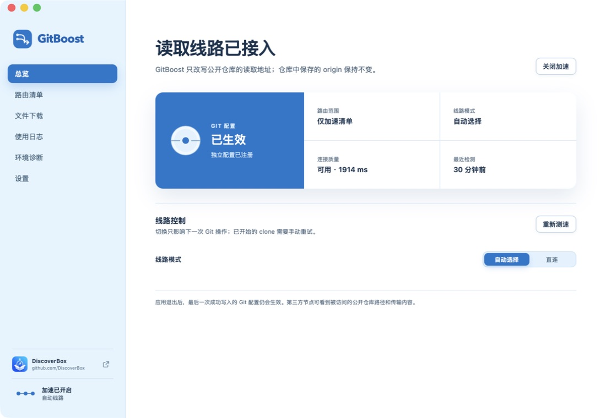
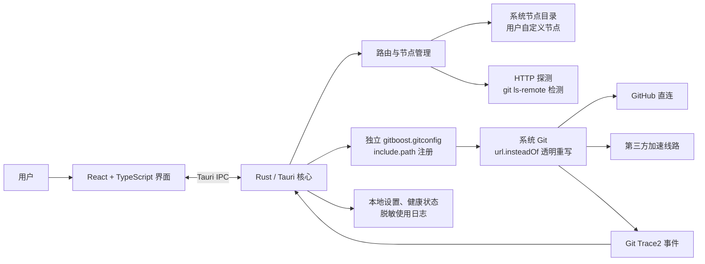

# GitBoost

GitBoost 为公开 GitHub 仓库选择可用的 HTTPS 加速线路。仓库里的 `origin` 仍然是 `https://github.com/...`，更换线路时不用修改 remote；GitBoost 写入的规则默认让 push 直连 GitHub。

> GitBoost 只适合加速公开仓库。第三方镜像能够看到仓库路径和传输内容，请勿用它访问私有仓库或传输敏感信息。

## 下载与开始使用

从 [GitHub Releases](https://github.com/DiscoverBox/gitboost/releases) 下载适合当前系统的安装包。第一次使用时，请按 [GitBoost 用户指南](docs/USER_GUIDE.md) 完成安装、路由清单设置和线路确认。



## 为什么要做 GitBoost

### 直接使用镜像会修改 remote

很多镜像要求在 clone 时使用镜像地址：

```bash
git clone https://example-mirror.com/https://github.com/owner/repository.git
```

Git 会把 clone 时使用的地址保存到 `remote.origin.url`，具体行为见 [Git clone 文档](https://git-scm.com/docs/git-clone#_description)。镜像失效或更换域名后，已有仓库也要逐个修改 remote。

GitBoost 改用 Git 原生的 [`url.<base>.insteadOf`](https://git-scm.com/docs/git-config#Documentation/git-config.txt-urlbaseinsteadOf) 规则。平时仍然使用原始 GitHub 地址：

```bash
git clone https://github.com/owner/repository.git
```

线路失效时在 GitBoost 中重新检测或切换节点即可，仓库里的 `origin` 不变。

“仅加速清单”沿用 Git `insteadOf` 的 URL 前缀匹配语义，不按仓库身份做精确匹配。例如，加入 `owner/repo` 后，`owner/repo-private` 也可能命中同一条路由。这是当前系统的既定路由特性，不作为待修复问题；如果同一 owner 下存在名称前缀相同且可能包含私有内容的仓库，请不要添加该前缀较短的仓库。

### Claude Code 的 Plugin 也需要访问 GitHub

[Claude Code Marketplace](https://code.claude.com/docs/en/plugin-marketplaces) 支持用 GitHub 的 `owner/repo` 作为来源。例如 [Superpowers Marketplace](https://github.com/obra/superpowers-marketplace) 的安装命令是：

```text
/plugin marketplace add obra/superpowers-marketplace
```

这条命令需要从 GitHub 取得仓库。GitHub 无法稳定访问时，添加 Marketplace、安装 Plugin 和后续更新都可能失败。

开启全局加速，或把对应的公开仓库加入路由清单后，GitBoost 会处理这类 GitHub HTTPS Git 请求。原来的 `owner/repo` 安装方式不用改，其他来源和安装方式见 [Claude Code 官方文档](https://code.claude.com/docs/en/discover-plugins)。

## 系统架构

GitBoost 使用 [Tauri 2](https://v2.tauri.app/) 开发。界面采用 React 19、TypeScript 和 Vite，线路检测、Git 配置和本地数据由 Rust 处理。



GitBoost 不提供代理服务。它只检测第三方线路，并通过独立的 `gitboost.gitconfig` 接入系统 Git。设置、节点状态和脱敏后的使用日志都保存在本机。

## 支持的系统

| 系统 | 架构 | 安装包 |
| --- | --- | --- |
| macOS 12 或更高版本 | Apple Silicon（arm64） | `.dmg`、`.app` |
| 64 位 Windows 10/11 | x86_64 | NSIS `.exe`、`.msi` |

当前不提供 Intel Mac、Universal macOS 或 Linux 安装包。Windows 用户需要预先安装 [Git for Windows](https://git-scm.com/download/win)。

> **当前安装包没有正式代码签名。**
>
> macOS 包未使用 Apple Developer ID 证书签名，也未经过 Apple 公证。Windows 包未配置发布者代码签名，可能显示“发布者未知”或触发 SmartScreen。请只从本项目的 [GitHub Releases](https://github.com/DiscoverBox/gitboost/releases) 下载。

### Code signing policy

GitBoost 正在申请 SignPath Foundation 的开源代码签名服务。申请和接入完成前，Windows 安装包仍按未签名软件处理；只有 Windows 显示 Authenticode 签名有效的发布包才可视为已签名。

Free code signing provided by SignPath.io, certificate by SignPath Foundation.

签名范围、负责人、可验证构建流程和隐私说明见 [Code signing policy](CODE_SIGNING_POLICY.md)。

## 开发与版本发布

### 环境准备

- Node.js 22
- Rust stable 工具链
- npm
- 系统 Git（Windows 使用 Git for Windows）

安装依赖并启动桌面开发环境：

```bash
npm ci
npm run tauri dev
```

### 测试命令

| 命令 | 用途 |
| --- | --- |
| `npm test` | 前端单元测试 |
| `npm run test:scripts` | 版本与发布脚本测试 |
| `cargo test --manifest-path src-tauri/Cargo.toml` | Rust 单元测试 |
| `npm run test:ui` | Playwright 桌面界面测试 |
| `npm run test:integration` | 使用真实系统节点和 `git ls-remote` 的核心链路集成测试，需要网络 |
| `npm run test:all` | 前端、脚本、Rust 和界面测试；不包含需要网络的集成测试 |

集成测试使用隔离的临时 Git 全局配置，不会修改开发机的 `~/.gitconfig`。

### 构建安装包

在 Apple Silicon Mac 上构建 `.app` 和 `.dmg`：

```bash
npm run build:macos
```

生成的 DMG 还会包含“无法打开时请双击”安装助手。用户把 GitBoost 拖入“应用程序”后，可以运行该助手移除应用的 macOS 隔离标记。

在 64 位 Windows 10/11 上构建 NSIS 和 MSI 安装包：

```powershell
npm ci
npm run build:windows
```

### 版本管理与发布

`package.json` 是应用版本的唯一来源。设置开发版本：

```bash
npm run version:set -- 0.3.0-dev.0
```

正式发布前，确认当前分支是 `main`、工作区没有未提交修改，并已与 `origin/main` 同步：

```bash
npm run release -- 0.3.0
```

脚本会检查仓库状态、更新版本、创建发布提交和 annotated tag，再原子推送 `main` 与 tag。GitHub Actions 随后构建 macOS 和 Windows 安装包，并创建 Draft Release。检查安装包后，还需要在 GitHub 上手动发布。

## 参与项目

问题和建议请提交到 [GitHub Issues](https://github.com/DiscoverBox/gitboost/issues)：

- 提供镜像来源时，请附上服务名称、公开主页或来源地址、可供验证的 GitHub HTTPS 示例、使用限制和已知风险。候选线路会经过真实的 `git ls-remote` 检测。
- 提交 Bug 时，请写明操作系统、GitBoost 版本、复现步骤、预期结果和实际结果。线路或 Git 配置问题可以附上“环境诊断”生成的脱敏报告。不要提交 Token、私有仓库地址或其他敏感信息。
- 提交代码时，请保持改动聚焦，并为新增或修复的行为补充测试。

## License

本项目采用 [**GNU General Public License v3.0（GPL-3.0）**](LICENSE) 开源。
