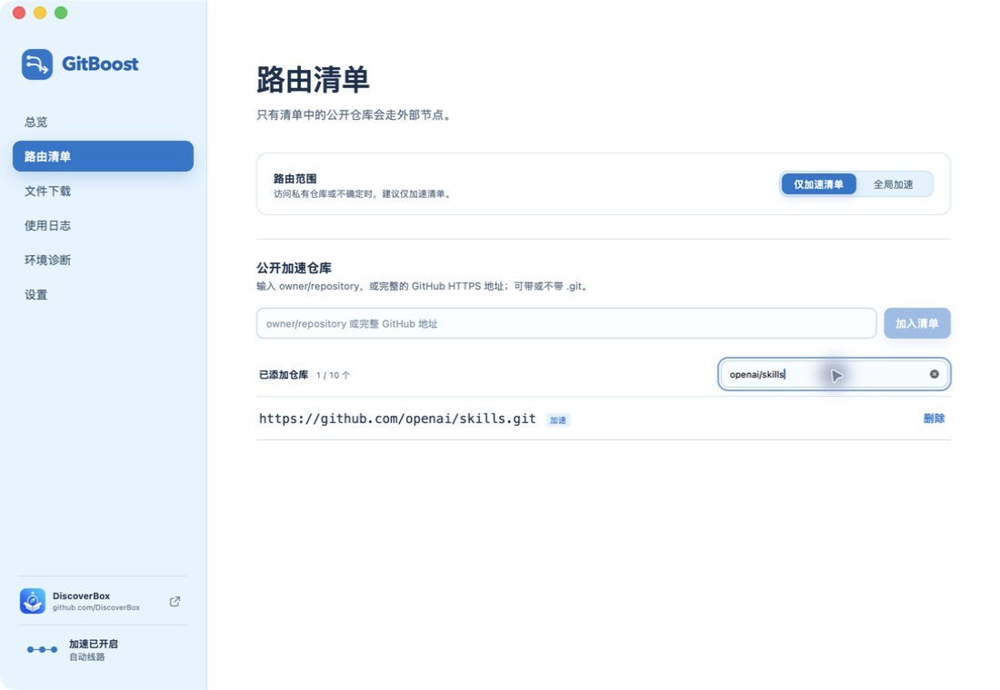
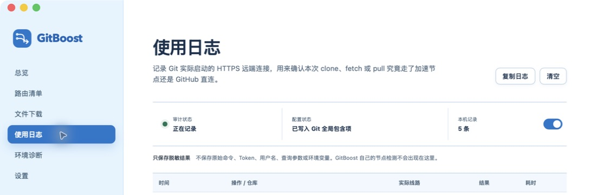
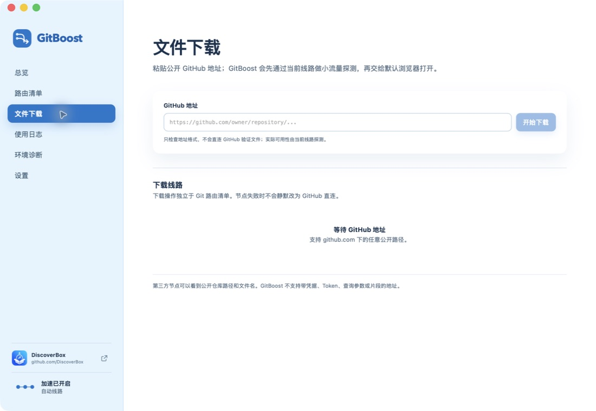
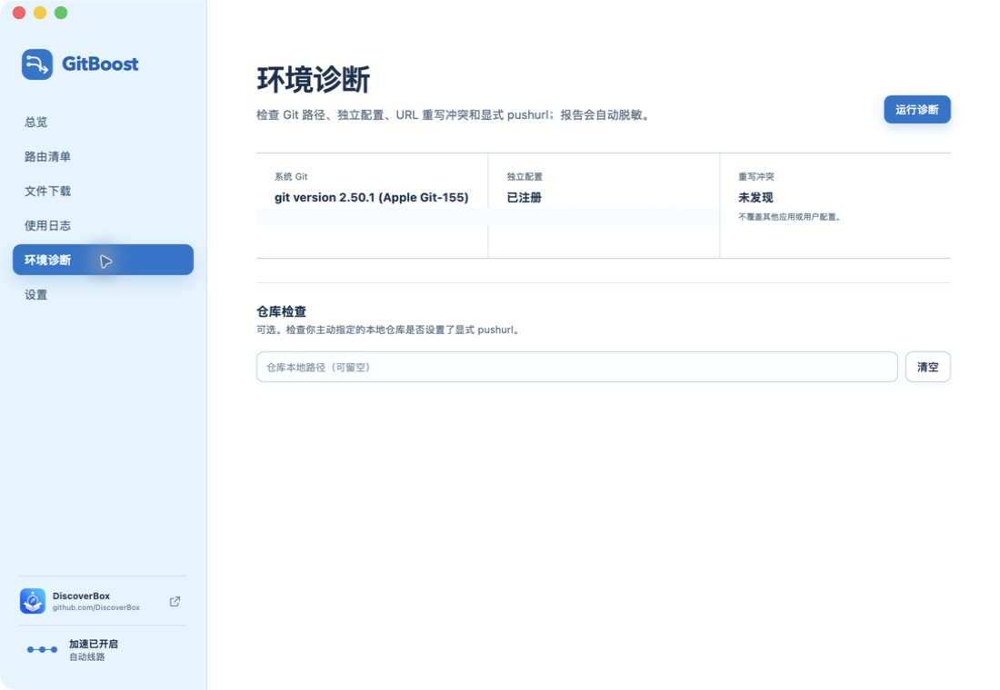
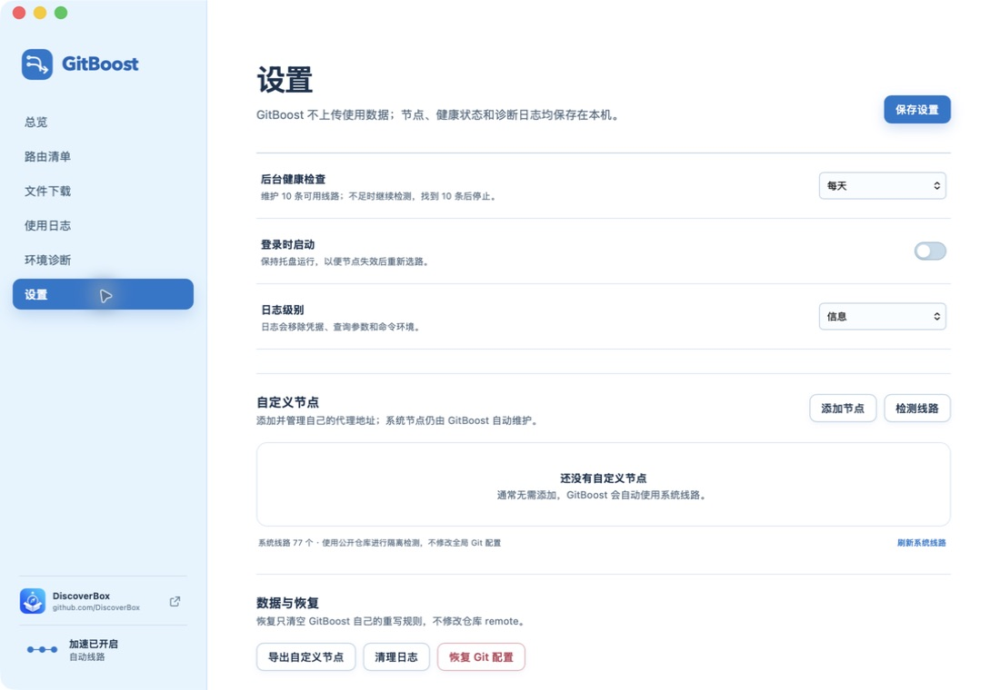

# GitBoost 使用指南

GitBoost 加速公开 GitHub 仓库的 HTTPS 读取。仓库地址不用改，仍然使用 `https://github.com/owner/repository.git`。它通过本机 Git 配置选择线路，不会改动仓库中保存的 `origin`，push 也默认直连 GitHub。

> 只建议用 GitBoost 访问公开仓库。第三方加速节点可以看到仓库路径和传输内容。如果可能访问私有仓库，或者拿不准仓库是否公开，请保留“仅加速清单”，不要把私有仓库加入清单。

## 1. 安装

目前支持：

- Apple Silicon（M 系列芯片）Mac，macOS 12 或更高版本；
- 64 位 Windows 10/11；
- GitHub HTTPS 地址。`git@github.com:owner/repository.git` 这类 SSH 地址不会被改写。

Windows 要先安装 [Git for Windows](https://git-scm.com/download/win)。macOS 可以在终端执行 `git --version`，看到版本号说明 Git 已经可用。

请只从项目的 [Releases 页面](https://github.com/DiscoverBox/gitboost/releases)下载安装包。安装前核对来源和文件名，不要使用其他站点提供的版本。

- macOS：打开 DMG，把 GitBoost 拖进“应用程序”。当前 macOS 版本没有使用 Apple Developer ID 证书签名，也没有经过 Apple 公证。确认安装包来自上述官方 Releases 页面，再双击 DMG 中的“无法打开时请双击”安装助手，按提示输入管理员密码。

  如果安装助手也被 macOS 阻止，可以打开终端执行：

  ```bash
  sudo xattr -rd com.apple.quarantine /Applications/GitBoost.app
  ```

  这条命令只移除 `/Applications/GitBoost.app` 及其内部文件的隔离标记。输入管理员密码时，终端不会显示任何字符，这是正常现象。命令执行完后，从“应用程序”中启动 GitBoost。
- Windows：当前安装包没有配置发布者代码签名，系统可能显示“发布者未知”或触发 SmartScreen。核对下载来源后，运行 EXE 或 MSI 安装包并按提示完成安装。

## 2. 第一次启用加速

### 第一步：确认 Git 环境

打开 GitBoost，先看“总览”页。“Git 配置”显示是否已经接入，“连接质量”显示当前线路和延迟。


页面提示“未检测到系统 Git”时，先安装 Git，再重新打开 GitBoost。

### 第二步：设置路由范围

进入“路由清单”。建议保留默认的“仅加速清单”，然后在输入框中填写公开仓库。下面两种格式都可以：

```text
owner/repository
https://github.com/owner/repository.git
```

点击“加入清单”后，仓库会出现在列表中。



“全局加速”会让所有 GitHub HTTPS 读取经过第三方节点。Git 无法判断仓库是否公开；只有确定不会访问私有仓库时，才使用这个模式。

清单沿用 Git `insteadOf` 的 URL 前缀匹配语义，不按仓库身份做精确匹配。例如，`owner/repo` 也可能匹配 `owner/repo-private`。这是当前系统的既定路由特性，不作为待修复问题；如果公开仓库和私有仓库存在这种命名关系，不要把前者加入清单。

### 第三步：开启加速

回到“总览”，点击“开启加速”或选择“自动选择”。第一次开启会看到一段安全说明，其中列出了第三方节点能够看到的信息。确认后，GitBoost 会写入并验证独立的 Git 配置。

启用成功后，继续使用原始地址即可：

```bash
git clone https://github.com/owner/repository.git
git -C repository fetch
git -C repository pull
```

remote 不用改成代理地址。

### 第四步：确认实际线路

保持 GitBoost 运行，执行一次 `clone`、`fetch` 或 `pull`，再打开“使用日志”。“实际线路”会显示这次操作走的是加速节点、GitHub 直连，还是其他 URL 重写。



使用日志只保存在本机，保留最近 7 天，不记录原始命令、Token、用户名、查询参数或环境变量。关闭“记录 Git 使用”不会影响加速和自动故障复检。

## 3. 日常使用

### 自动选路和重新测速

“自动选择”只会使用通过真实 Git 检测的线路。想立即刷新线路状态，可以在“总览”点击“重新测速”，或者到“设置”点击“检测线路”。

如果 Git 操作因线路异常失败，GitBoost 会为下一次命令换线，不会接管或自动重试已经开始的命令。需要手动再执行一次。

### 临时恢复 GitHub 直连

在“总览”点击“关闭加速”，或者把线路模式切换为“直连”。切换只影响之后的 Git 操作。

别把退出应用当成关闭加速：最后一次成功写入的 Git 配置仍然有效。想在退出后保持 GitHub 直连，要先在“总览”关闭加速。

### 下载公开 GitHub 文件

“文件下载”支持 `github.com` 下的公开页面和文件地址。粘贴地址并点击“开始下载”，GitBoost 会先用当前线路做一次小流量探测，再交给系统默认浏览器打开。



文件下载不受 Git 路由清单影响。地址中不能带用户名、密码、Token、查询参数或片段。当前节点失败时，GitBoost 也不会悄悄改走 GitHub 直连。按页面提示换一条线路再试即可。

## 4. 环境诊断

遇到配置冲突、fetch 或 push 地址异常，或准备提交问题时，可以打开“环境诊断”：

1. 先检查系统 Git、独立配置和重写冲突状态；
2. 如需检查某个仓库，在“仓库本地路径”中填写该仓库目录；
3. 点击“运行诊断”；
4. 点击“复制脱敏报告”，复制排查结果。



> 截图中的本机路径已经隐去。GitBoost 不会覆盖其他应用或用户已有的 URL 重写配置。发现冲突时，先根据诊断报告确认来源。

诊断页中的地址含义如下：

- “保存值”：仓库中原本保存的 remote；
- “fetch 有效地址”：Git 实际用于读取的地址；
- “push 有效地址”：Git 实际用于推送的地址；
- “显式 pushurl”：仓库单独设置的推送地址。只要存在这个配置，push 就不一定直连 GitHub，需要单独确认。

## 5. 设置与恢复

“设置”页集中放置后台健康检查、登录时启动、日志级别、自定义节点和恢复工具。



- **后台健康检查**：默认每天维护可用线路，找到 10 条后停止检测。
- **登录时启动**：建议开启，方便应用在后台接收 Git 使用结果，并在节点失效后重新选路。
- **日志级别**：日常使用选“信息”即可，排查问题时再临时改成“调试”。
- **自定义节点**：通常不用添加。需要时，每行填写一个 HTTPS 代理地址，再运行线路检测。
- **导出自定义节点**：只导出你自己添加的节点。
- **清理日志**：清除 GitBoost 的本地日志。
- **恢复 Git 配置**：删除 GitBoost 自己注册的包含项并清空自己的重写规则，不修改任何仓库的 remote。

## 6. 常见问题

### 开启加速后仍然很慢

先点击“重新测速”。如果当前命令已经失败或卡住，结束命令，等选路完成后手动重试。自动切换只对下一次 Git 操作生效。

### 提示没有可用线路

到“设置”依次点击“刷新系统线路”和“检测线路”。检测过程需要联网，并会对公开仓库执行隔离的真实 Git 探测。

### 使用日志没有记录

逐项确认：

1. GitBoost 正在运行；
2. “记录 Git 使用”已经开启；
3. 执行的是 GitHub HTTPS 的 `clone`、`fetch` 或 `pull`，而不是 SSH 操作。

应用退出后无法接收 Git 事件，所以这段时间的日志不会补记，GitBoost 也无法根据实际 Git 失败自动换线。

### push 会经过第三方节点吗

默认不会，push 直连 GitHub。但仓库显式设置了 `pushurl` 时，以该配置为准。具体地址可以在“环境诊断”中检查。

### 如何彻底停用 GitBoost 配置

只是暂时不用，可以在“总览”切换为“直连”。要移除 GitBoost 写入的 Git 配置，到“设置”点击“恢复 Git 配置”。这个操作不会删除仓库，也不会修改仓库中保存的 remote。
